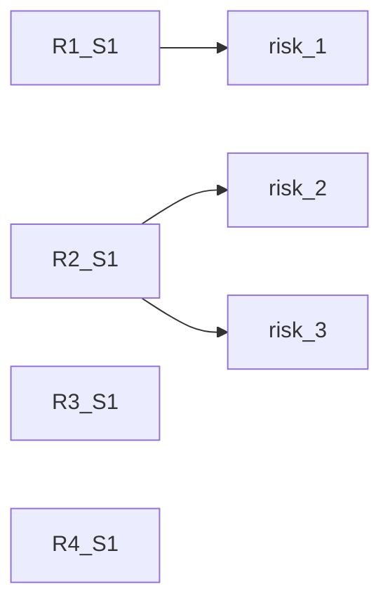

# Risk

This application could also track the risks of the project, allowing you to point out requirements and why they might be
a problem later down the road.

## Requirement Attributes

| Attribute    | Type        | Description                                                                                                        |
| :----------- | :---------- | :----------------------------------------------------------------------------------------------------------------- |
| UUID         | UUID or int | A unique identifier for this requirement in this set of requirements.                                              |
| ID           | string      | A requirement ID given by by the user to identify this requirement.                                                |
| Text         | string      | The text for this ID, this is where the user indicates what the requirement is, this should be in markdown format. |
| Dependencies | List[UUID]  | A list of the requirements/Documents that depend on this requirement. They might be derived from this one.         |

## Connection Example

