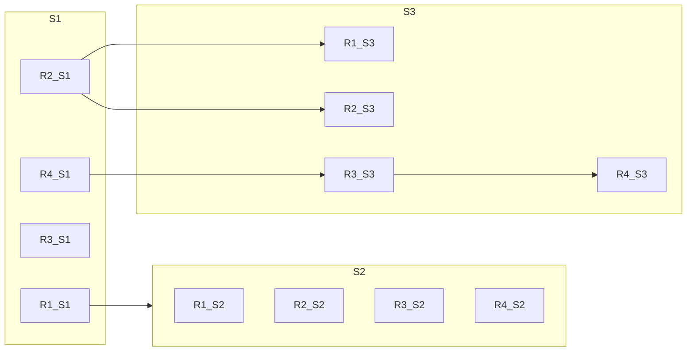

# Requirement

This application tracks the connection of requirements to each other. This is
what a requirement should contain to be considered complete.

## Requirement Attributes

| Attribute    | Type        | Description                                                                                                        |
| :----------- | :---------- | :----------------------------------------------------------------------------------------------------------------- |
| UUID         | UUID or int | A unique identifier for this requirement in this set of requirements.                                              |
| ID           | string      | A requirement ID given by by the user to identify this requirement.                                                |
| Text         | string      | The text for this ID, this is where the user indicates what the requirement is, this should be in markdown format. |
| Dependencies | List[UUID]  | A list of the requirements/Documents that depend on this requirement. They might be derived from this one.         |
| Dependents   | List[UUID]  | A list of requirements/Documents that this requirement depends on.                                                 |
| Risks        | List[Risk]  | A list of risks associated to this requirement.                                                                    |

## Connection Example

